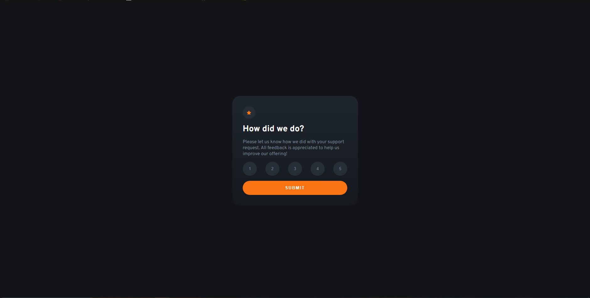

# Frontend Mentor - Interactive rating component solution

<!-- custom shield.io links -->
[![Status][shield-link]][complete-link] 

[shield-link]: https://img.shields.io/badge/STATUS-COMPLETE-00ff55
[complete-link]: https://img.shields.io/badge/STATUS-COMPLETE-00ff55 
<!-- need to change -->

[![Front end mentor link][shield-link2]][my-link2] [![Github Link][shield-link3]][my-link3]

[shield-link2]: https://img.shields.io/badge/_Profile-EJ--STONIEEEEE-6abecd?style=for-the-badge&logo=frontendmentor&logoColor=6abecd
[my-link2]: https://www.frontendmentor.io/profile/Stonieeeee
[shield-link3]: https://img.shields.io/badge/_Github-EJ--STONIEEEEE-adbac7?style=for-the-badge&logo=github&logoColor=adbac7
[my-link3]: https://github.com/Stonieeeee

This is a solution to the [Interactive rating component coding challenge on Frontend Mentor](https://www.frontendmentor.io/challenges/interactive-rating-component-koxpeBUmI). Frontend Mentor challenges help you improve your coding skills by building realistic projects.

## Table of contents 📌

- [Frontend Mentor - Interactive rating component solution](#frontend-mentor---interactive-rating-component-solution)
  - [Table of contents 📌](#table-of-contents-)
  - [Overview 🔍](#overview-)
    - [The Challenge 🧗‍♂️](#the-challenge-️)
    - [Link 🔗](#link-)
    - [Screenshot 📸](#screenshot-)
  - [My Process](#my-process)
    - [Built with 🔨](#built-with-)
    - [Added Feature ✨](#added-feature-)
  - [Author ✍️](#author-️)

## Overview 🔍

### The Challenge 🧗‍♂️

**Users should be able to:**

- View the optimal layout for the app depending on their device's screen size
- See hover states for all interactive elements on the page
- Select and submit a number rating
- See the "Thank you" card state after submitting a rating

### Link 🔗

- <a href="" target="_blank">Solution (Frontend Mentor)</a>
- <a href="" target="_blank">Live Site (Github)</a>

### Screenshot 📸

 

 **This is a screenshot from my solution.** 

## My Process

### Built with 🔨

<!-- Bagdes -->

[![HTML5][design-link]][html-link] [![JavaScript][design-link2]][js-link] [![Git][design-link3]][git-link]

<!-- Badges-links -->

[design-link]: https://img.shields.io/badge/HTML5-E34F26?style=for-the-badge&logo=html5&logoColor=white

[html-link]: https://developer.mozilla.org/en-US/docs/Glossary/HTML5

[design-link2]: https://img.shields.io/badge/javascript-%23323330.svg?style=for-the-badge&logo=javascript&logoColor=%23F7DF1E

[js-link]: https://developer.mozilla.org/en-US/docs/Web/JavaScript

[design-link3]: https://img.shields.io/badge/Git-F05032?style=for-the-badge&logo=git&logoColor=white

[git-link]: https://git-scm.com

- Semantic HTML5 Markup
- Flexbox Layout

### Added Feature ✨

## Author ✍️

- Frontend Mentor - <a href="https://www.frontendmentor.io/profile/Stonieeeee" target="_blank">Stonieeeee</a>
- Github - <a href="https://github.com/Stonieeeee" target="_blank">Stonieeeee</a>